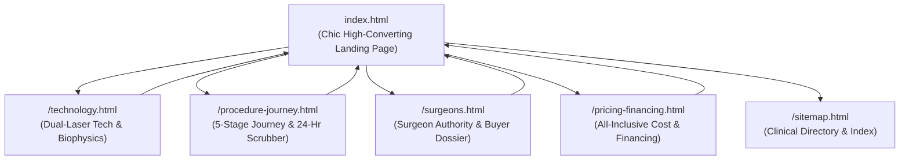

# Specification: Chic High-Converting Landing Page & 4 Dedicated Educational Subpages

**Date:** 2026-09-29  
**Status:** In Review (Architectural Design Spec)  
**Author:** Antigravity Autonomous Orchestrator  
**Client/Project:** Marano Eye Care – Custom Wavefront LASIK Portal  

---

## 1. Executive Summary & Objective

### 1.1 The Challenge
The current `index.html` is an enormous monolithic document (>4,900 lines of code, ~318KB) that packs deep optical biophysics, sub-micron corneal topography, extensive surgeon biographies, a 24-hour hour-by-hour recovery timeline, a 5-question buyer dossier against retail mills, full financial calculations, 14 long testimonials, and dozens of FAQs into a single scrolling page. 

While clinical rigor and E-E-A-T credentials are world-class, this density introduces high cognitive load for first-time prospective patients seeking clear answers, fast booking, and immediate trust.

### 1.2 The Solution
Restructure the portal into a **high-converting, chic, sleek flagship landing page** (`index.html`) while migrating the deep clinical, biographical, diagnostic, and procedural content to **4 dedicated educational subpages**:

1. **`/technology.html`**: Dual-Laser Technology, WaveScan® 3D Iris Aberrometry, Cold Ultraviolet Excimer Ablation & Corneal Topography.
2. **`/procedure-journey.html`**: The 5-Stage CustomVue® Procedure, 24-Hour Recovery Scrubber, and Day-by-Day Post-Op Protocols.
3. **`/surgeons.html`**: Comprehensive Biographies (Dr. Matthew Marano & Dr. Sherief Raouf), Hospital Appointments, and the 5 Buyer Questions Dossier ("The Marano Standard vs. Commercial Mills").
4. **`/pricing-financing.html`**: Transparent All-Inclusive Investment, CareCredit 0% APR Financing, Pre-Tax HSA/FSA Calculations, and Lifetime Lens Expense Comparisons.

### 1.3 Key User Directives Honored
- **Retain Core Interactive Tools on Home Page:** Per user selection, the **20/15 Vision Simulator**, **60-Second Candidacy Quiz**, and **Financial ROI Calculator** remain directly on `index.html` to drive high engagement, micro-commitments, and immediate lead qualification.
- **Push Deep Educational Reading to Subpages:** Dense scientific literature, 3D corneal topography diagrams, 5-stage procedural breakdowns, and extended biographical dossiers move to dedicated URLs with full SEO/schema optimization.

---

## 2. Information Architecture & URL Structure

### 2.1 Navigation & Cross-Linking Standard
Every page will share an identical, cohesive luxury navigation header and footer:
- **Global Header:**
  - Marano Eye Care Gold/White Logo (links to `index.html`)
  - Primary Nav Links:
    - `Candidacy` (scrolls to `#quiz` or links to `/index.html#quiz`)
    - `Technology` (links to `/technology.html`)
    - `Procedure & Recovery` (links to `/procedure-journey.html`)
    - `Surgeons` (links to `/surgeons.html`)
    - `Cost & Financing` (links to `/pricing-financing.html`)
  - Phone Link: `(973) 419-5972`
  - Primary CTA: `Schedule Consultation` (links to `/index.html#booking`)
- **Global Footer:**
  - 4 Office Centers (Livingston, Denville, Newark)
  - Full Subpage Clinical Directory
  - Medical Disclaimer & Board of Medical Examiners Disclosures
  - WCAG AAA 48px Touch Targets

---

## 3. Page Specifications

### 3.1 Flagship Landing Page (`index.html`)
**Aesthetic Style:** Ultra-sleek dark spatial UI, deep obsidian background (`#060911`), atmospheric radial lighting, champagne gold (`#e2b857`), optical cyan (`#00f0ff`), and specular frosted glass panels.

**Page Flow & Section Hierarchy:**
1. **Sticky Header:** Compact navigation with quick links to all subpages and 1-tap phone dial.
2. **Hero Section:**
   - Bold, punchy headline: *"Goodbye Lenses. Hello High-Definition Freedom."*
   - Subtitle: *"Sharper than your best prescription. Zero lenses required."*
   - Proof Pills: *"Thousands of Successful LASIK Procedures • 30+ Years Leadership • 680+ 5-Star Reviews"*
   - Embedded 2-Step Micro-Commitment Consultation Form (`#hero-mc-card`) with Netlify form handling and instant feedback.
3. **Interactive 60-Second Candidacy Screener (`#quiz`):**
   - 4-step streamlined eligibility quiz (Age, Prescription, Dry Eye / Corneal health, Timeline) delivering immediate qualification feedback and priority consultation booking.
4. **Interactive 20/15 vs. 20/20 Vision Simulator (`#lasik-vision-simulator-section`):**
   - High-definition night-driving split slider showing real-world visual aberration correction (halos/glare/myopia vs. crisp 20/15 wavefront optics).
5. **Surgeon Authority Highlights (`#surgeons`):**
   - Sleek dual-card presentation: Dr. Matthew Marano (Chief of Ophthalmology, 40k+ procedures, 15x NJ Top Doc) & Dr. Sherief Raouf (UIC Cornea Fellowship Specialist).
   - Prominent link: *"View Full Surgical Profiles, Hospital Leadership & Research →"* (`/surgeons.html`).
6. **Lifestyle Visual Freedom Strip (`#lifestyle`):**
   - Compact 4-tab interactive switcher showing how life improves: Sports/Fitness, Night Driving, Screen Work, Outdoor/Travel.
7. **Financial ROI & Cost Calculator (`#roi-section`):**
   - Interactive slider: Monthly contact/glasses spend -> Lifetime expense ($37,000+) vs. one-time LASIK investment with pre-tax HSA/FSA savings.
   - Link: *"Explore All 0% APR Financing & Payment Options →"* (`/pricing-financing.html`).
8. **Curated Clinical Teaser Bento Grid ("The Science of Visual Clarity"):**
   - 4 elegant glassmorphic cards introducing the deep subpages:
     - Card A: **Dual-Laser System & Biophysics** → *"Discover WaveScan 3D Iris Aberrometry"* (`/technology.html`)
     - Card B: **5-Stage CustomVue Journey & 24-Hr Scrubber** → *"See the 10-Second Laser Process"* (`/procedure-journey.html`)
     - Card C: **The Marano Standard vs. Commercial Mills** → *"5 Questions Every Provider Must Answer"* (`/surgeons.html#buyer-dossier`)
     - Card D: **Transparent Pricing & 0% CareCredit** → *"Explore HSA/FSA Tax Strategies"* (`/pricing-financing.html`)
9. **Social Proof & Verified Patient Outcomes (`#reviews`):**
   - Curated showcase of verified 5-star Google patient outcomes with star ratings and localized New Jersey badges.
10. **Curated Top 5 FAQs (`#faq`):**
    - Accordion addressing the top 5 patient concerns (Does it hurt? How long does it take? When can I drive? What if I blink? What is the recovery time?).
    - Link: *"See All Clinical FAQs & Procedure Guidelines →"* (`/procedure-journey.html#faq`).
11. **Practice Locations & Final Booking Suite (`#contact`):**
    - Office cards for Livingston Flagship (ACC Suite 209), Denville Suite 301, and Newark Suite.
    - Secondary consultation booking form.
12. **Mobile Sticky Conversion Bar:** Persistent dial + schedule buttons for viewport ≤768px.

---

### 3.2 Subpage 1: How LASIK Works (`technology.html`)
**Focus:** Complete patient education, laser mechanics, and 3D eye mapping.

**Key Content & Modules:**
- **Hero:** *"How LASIK Works: The Architecture of Sharp, Clear, Crisp Visual Freedom"*
- **The WaveScan® Diagnostic System:** 
  - Hartmann-Shack sensor mechanics; measuring 240+ optical aberrations 25x more accurately than standard phoropter exams.
  - Iris Registration technology compensating for pupil cyclotorsion (eye rotation between standing and lying down).
- **The STAR S4 IR® Excimer Laser:**
  - 193nm cold ultraviolet laser photoablation (reshaping corneal stroma without thermal damage).
  - Variable Spot Scanning (VSS) and 3D Active Eye Tracker operating at 60Hz.
- **Corneal Topography & Elevation Mapping:**
  - Sub-micron Pentacam® Scheimpflug imaging, anterior/posterior elevation maps, pachymetry mapping.
  - Interactive Corneal Topography Visualizer script integrated.
- **Comparison Architecture:** Custom Wavefront-Guided vs. Wavefront-Optimized vs. Conventional Bladed LASIK.
- **Clinical Citations & ASCRS/FDA References.**
- **Conversion CTAs:** Direct booking and candidacy test integration.

---

### 3.3 Subpage 2: The 5-Stage CustomVue Journey & 24-Hour Recovery (`procedure-journey.html`)
**Focus:** Alleviating procedural anxiety, detailing step-by-step patient experience, and setting clear recovery expectations.

**Key Content & Modules:**
- **Hero:** *"10 Painless Seconds Per Eye. Next-Day Visual Freedom."*
- **The 5-Stage Laser Journey:**
  1. *Stage 01: 3D WaveScan Diagnostic Mapping & Iris Fingerprinting*
  2. *Stage 02: Blade-Free Femtosecond Flap Creation (IntraLase laser precision)*
  3. *Stage 03: Custom Ultraviolet Reshaping (Cold excimer photoablation)*
  4. *Stage 04: Flap Repositioning & Natural Capillary Adhesion (No stitches)*
  5. *Stage 05: Immediate Stabilization & Next-Day Clarity*
- **Interactive 24-Hour Recovery Scrubber:**
  - Full hour-by-hour interactive timeline (Hour 0 discharge, Hour 2 nap, Hour 6 functional sight, Hour 12 clear TV/reading, Hour 24 driving to clinic for follow-up).
- **Day-by-Day Post-Op Expectations:**
  - Day 1: 20/20 or better driving checkup.
  - Week 1: Resume gym, non-contact sports, light eye makeup.
  - Month 1: Complete corneal nerve stabilization.
  - Month 3–12: Permanent high-definition visual lock-in.
- **Medication & Eye Drop Protocol:** Antibiotic, anti-inflammatory, and preservative-free artificial tear timelines.
- **Surgery Day Itinerary:** What to expect during the 90-minute clinic visit.

---

### 3.4 Subpage 3: Refractive Surgeons & Clinical Standards (`surgeons.html`)
**Focus:** E-E-A-T leadership, hospital credentials, surgeon mentorship, and consumer empowerment against retail mill shortcuts.

**Key Content & Modules:**
- **Hero:** *"Over 40,000 Surgical Procedures. 30+ Years of Refractive Leadership in New Jersey."*
- **Dr. Matthew J. Marano, Jr., M.D. Dossier:**
  - Chief of Ophthalmology at Cooperman Barnabas Ambulatory Care Center (Livingston) & St. Michael's Medical Center (Newark).
  - 15-Time New Jersey Monthly "Top Doctor".
  - Pioneer of refractive surgery in NJ since early FDA clinical trials.
  - Surgical educator and proctor who has trained ophthalmic peers on treating complicated, challenging corneal and refractive cases.
  - Fellow of FAAO & ASCRS.
- **Dr. Sherief Raouf, M.D. Dossier:**
  - Board-Certified Cornea, External Disease & Refractive Surgery Specialist.
  - Fellowship-trained at the acclaimed Illinois Eye and Ear Infirmary (UIC).
  - Specialty focus in complex astigmatism, thin cornea diagnostics, and wavefront laser correction.
- **The 5 Critical Questions Every LASIK Provider Must Answer:**
  1. *Will my pre-operative and post-operative exams be performed by the actual surgeon, or handed off to non-surgical staff?*
  2. *Do you use a mechanical metal microkeratome blade or a 100% blade-free femtosecond laser?*
  3. *Does your laser feature 3D active iris eye-tracking and cyclotorsional compensation?*
  4. *Is every diagnostic scan custom wavefront-guided or a generic wavefront-optimized approximation?*
  5. *Is all-inclusive post-operative enhancement care included in the quoted price, or billed separately?*
- **The Marano Standard vs. Commercial Mill Matrix:** Detailed comparison table exposing hidden fees, retail turnover quotas, and recycled blades.

---

### 3.5 Subpage 4: All-Inclusive Pricing, Financing & Lifetime ROI (`pricing-financing.html`)
**Focus:** Complete financial transparency, eliminating sticker shock, and demonstrating long-term economic superiority over lenses.

**Key Content & Modules:**
- **Hero:** *"Transparent, All-Inclusive Investment in Your Vision. Zero Hidden Fees."*
- **What "All-Inclusive" Actually Means:**
  - Comprehensive pre-operative WaveScan® mapping & Pentacam® diagnostics.
  - Dual-laser surgical suite (Femtosecond flap + STAR S4 IR® excimer).
  - All surgeon fees and facility fees.
  - All post-operative checkups for 12 full months.
  - Free enhancement warranty if prescription adjustments are needed.
- **The $37,000 Lifetime Contact Lens Tax:**
  - Audited mathematical breakdown of 25 years of daily disposable lenses, cleaning solutions, replacement glasses, prescription sunglasses, and annual eye doctor exams.
- **Financing & Payment Methods:**
  - **CareCredit:** 0% APR promotional financing options (up to 24 months interest-free).
  - **Pre-Tax HSA & FSA Dollars:** How to use tax-advantaged healthcare accounts to save 20%–35% on LASIK.
  - **Vision Insurance Discounts:** How out-of-network benefits with VSP, EyeMed, and major carriers provide 15%–20% contractual discounts.
- **Exposing the "$250/Eye" Retail Trap:** Clear explanation of how retail discounters bait patients with unrealistic pricing that only applies to rare micro-prescriptions while upcharging thousands for safety essentials.

---

## 4. Technical Architecture, SEO & Performance

### 4.1 Shared CSS & Modular Scripts
- Existing `assets/custom-styles.css` is leveraged, with targeted subpage styling rules for breadcrumbs, hero banners, and side-by-side matrices.
- Shared navigation and footer styles across all 5 pages (`index.html`, `technology.html`, `procedure-journey.html`, `surgeons.html`, `pricing-financing.html`).
- Fast static asset delivery; no external dependencies that introduce layout shifts (CLS < 0.05).
- WebGL / Canvas fallbacks for interactive topography and simulation elements.

### 4.2 SEO, Canonical Tags & JSON-LD Structured Data
- Every page includes:
  - Canonical URL (`https://lasik.maranoeye.com/<page>.html`)
  - Unique Meta Title & Meta Description adhering to target keywords
  - OpenGraph & Twitter Card metadata
  - Dedicated `BreadcrumbList` Schema
  - Specialized `MedicalWebPage` and `MedicalProcedure` schema markup
- Full local SEO NAP (Name, Address, Phone) consistency across all 3 NJ locations (Livingston, Denville, Newark).

### 4.3 Conversion Tracking Continuity
- All pages preserve the existing Google Tag Manager (`GT-WKTZM5GN`), Google Analytics 4 (`G-71SK3LQF49`), Google Ads (`AW-18197167741`), CallRail phone swapping script, and Netlify hidden consultation form support.

---

## 5. Verification & Acceptance Criteria
1. **Navigation:** Every link in header, footer, and cards correctly routes between home and the 4 subpages without 404s.
2. **Interactive Tools:** Vision Simulator, Candidacy Quiz, and ROI Calculator work smoothly on `index.html`.
3. **Subpage Depth:** Each subpage provides exhaustive, authoritative clinical content without placeholders or "lorem ipsum".
4. **Performance:** `index.html` loads rapidly without visual clutter, maintaining responsive fluidity from 390px mobile to 4K desktop.
5. **No Deployment:** Build and verify locally via `server.cjs` (port 4000); strictly zero Netlify or remote deployment per AGENTS.md rules.
