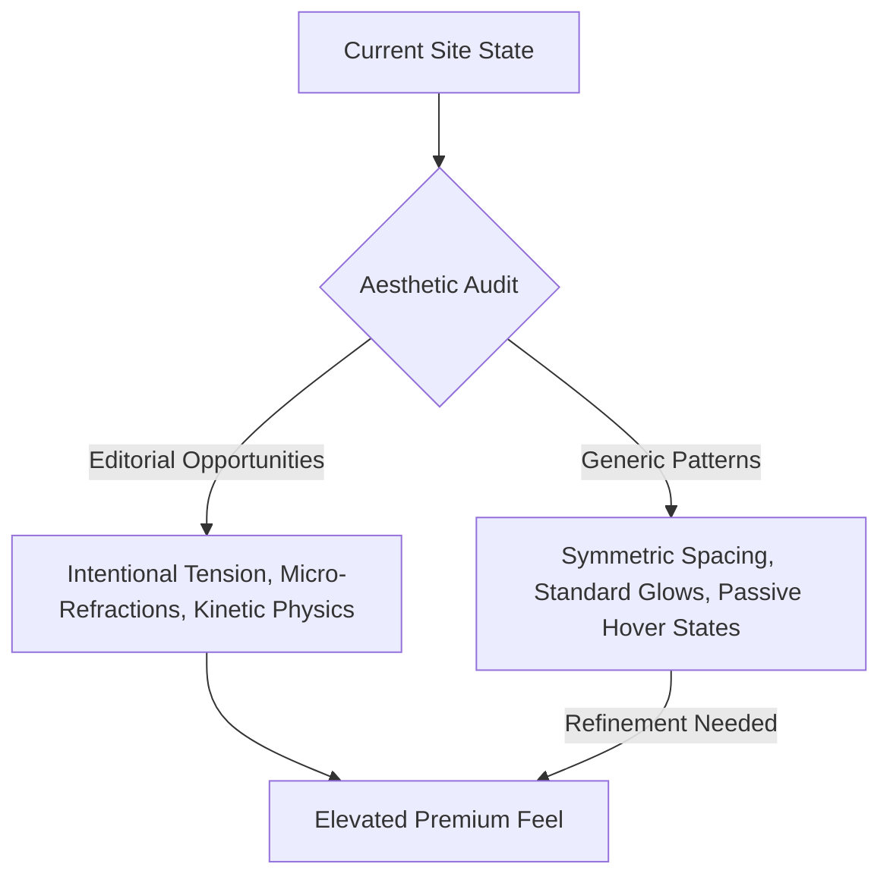

# Premium Aesthetic & Conversion Audit
## Marano Eye Care Refractive Suite (LASIK Journey)

Prepared by the **Antigravity AI Landing Page Operating System**  
*Operating Doctrine: Conversion > Clarity > Aesthetic Novelty*

---

## 1. Core Strategic Position & Emotional Core

| Pillar | Strategic Alignment |
| :--- | :--- |
| **Target Audience** | High-net-worth professionals, athletes, and detail-oriented individuals seeking visual liberation from corrective lenses, who demand clinical precision and elite-tier care. |
| **Core Desire** | Uncompromised vision ("Beyond 20/20") and the status of visual freedom. |
| **Primary Hesitation** | Fear of surgical complications, blindness, or clinical cutting tools. |
| **Category Convention to Exploit** | Competitor sites use clinical, cold, blue-light sterile themes filled with stock photos of happy couples on beaches. We position as a high-end medical-tech lab, blending **luxury hospitality** with **military-grade scientific rigor**. |
| **The Differentiation Angle** | The *Custom Wavefront-Guided Refractive Suite* utilizing a proprietary, dual-laser, non-bladed physical workflow. |

---

## 2. Global Anti-AI Aesthetic Diagnostic

Our audit reveals that the codebase already possesses an exceptional foundation (asymmetrical testimonials grid, precise scientific footnotes, custom typography pairings, and laser step progress states). However, to transform this from a "highly polished website" into a **luxury digital artifact**, we must eliminate standard SaaS design patterns and replace them with high-end, bespoke editorial details.

### The Diagnostic Matrix



---

## 3. High-Leverage Opportunities & Design Specs

We have broken down the premium opportunities into four major zones. Each zone features a **Safe**, **Bold**, and **Contrarian** creative direction.

### Zone 1: The Hero Canvas & Visual Tension
*Currently: Clean grid, static layout, subtle floating overlays.*

*   **Safe Direction (Fluid Spacing):** Adjust padding to use fluid viewport units (`clamp()`) to ensure no visual awkwardness at any breakpoint.
*   **Bold Direction (Cinematic Contrast & Textures) [RECOMMENDED]:** Introduce an ultra-fine tactile grain overlay (`mix-blend-mode: overlay`) across the background and apply a custom light-refraction glassmorphism card structure. This makes the hero image feel physically present rather than "rendered."
*   **Contrarian Direction (Extreme Asymmetry):** Push the text column to a narrow, high-contrast column on the left and extend the laser-eye schematic edge-to-edge on the right, completely breaking the grid layout.

#### Proposed CSS Implementation (Bespoke Glass Refraction):
```css
/* Tactile Noise Overlay to break the digital flatness */
body::after {
  content: "";
  position: fixed;
  top: 0; left: 0; width: 100vw; height: 100vh;
  background-image: url("data:image/svg+xml,%3Csvg viewBox='0 0 200 200' xmlns='http://www.w3.org/2000/svg'%3E%3Cfilter id='noiseFilter'%3E%3CfeTurbulence type='fractalNoise' baseFrequency='0.65' numOctaves='3' stitchTiles='stitch'/%3E%3C/filter%3E%3Crect width='100%25' height='100%25' filter='url(%23noiseFilter)'/%3E%3C/svg%3E");
  opacity: 0.015;
  pointer-events: none;
  z-index: 9999;
}

/* Premium Light Refraction on Hero Glass Panel */
.hero-image-card {
  position: relative;
  background: linear-gradient(135deg, rgba(13, 18, 29, 0.7) 0%, rgba(8, 11, 17, 0.9) 100%) !important;
  border: 1px solid rgba(255, 255, 255, 0.04) !important;
}
.hero-image-card::before {
  content: '';
  position: absolute;
  top: 0; left: -150%; width: 50%; height: 100%;
  background: linear-gradient(90deg, transparent, rgba(255, 255, 255, 0.03), transparent);
  transform: skewX(-25deg);
  transition: 0.75s var(--transition-premium);
}
.hero-image-wrapper:hover .hero-image-card::before {
  left: 150%;
  transition: 1.2s cubic-bezier(0.16, 1, 0.3, 1);
}
```

---

### Zone 2: Dual-Laser Interaction Suite
*Currently: Progress dots with active-radar pulses.*

*   **Safe Direction (Glow Polish):** Enhance color-matching of the laser dots to their respective steps.
*   **Bold Direction (Tactical HUD Optics) [RECOMMENDED]:** Redesign the active progress indicators to display as micro-diagnostic HUD overlays. When active, display fine coordinate ticks, coordinate text, and sub-millimeter measurements (e.g., `FLAP THICKNESS: 110µm`) that update dynamically. This reinforces clinical expertise and eliminates "generic bullet" feel.
*   **Contrarian Direction (Terminal Diagnostics):** Transform the entire layout into an ultra-premium medical terminal theme, stripping away icons and using highly-detailed vector lines, monochromatic palettes, and fine coordinates.

#### Proposed CSS & JS Conceptual Logic (Diagnostic Reticles):
```css
/* Tactical Diagnostics Overlay for Laser Step Progress */
.active-radar-dot::before {
  content: "SYS_OK // 1053nm" !important;
  position: absolute;
  top: -24px;
  left: 50%;
  transform: translateX(-50%);
  font-family: monospace;
  font-size: 0.55rem;
  letter-spacing: 1px;
  color: var(--accent-tertiary);
  white-space: nowrap;
  opacity: 0.8;
}
```

---

### Zone 3: Micro-Interactions & Conversions
*Currently: Solid, high-contrast CTA hover animations.*

*   **Safe Direction:** Increase scale slightly on hover.
*   **Bold Direction (Refractive Liquid Border) [RECOMMENDED]:** Standard buttons transition abruptly. To elevate the feel, apply a subtle gradient border animation that glides around the button edge on hover, reacting to mouse coordinates.
*   **Contrarian Direction (Silent High-End):** Completely remove the heavy colored button fills and replace them with high-contrast, razor-thin white borders, using font-weight shifts and slow opacity transitions to convey absolute luxury restraint.

#### Proposed CSS Implementation (Liquid Gradient CTA):
```css
/* Animated Border Refraction for CTA Buttons */
.btn-primary {
  position: relative;
  overflow: hidden;
  z-index: 1;
}
.btn-primary::after {
  content: '';
  position: absolute;
  top: -50%; left: -50%; width: 200%; height: 200%;
  background: radial-gradient(circle, rgba(255,255,255,0.15) 0%, transparent 60%);
  transform: scale(0.5);
  opacity: 0;
  transition: transform 0.6s var(--transition-premium), opacity 0.6s ease;
  z-index: -1;
}
.btn-primary:hover::after {
  transform: scale(1.2);
  opacity: 1;
}
```

---

### Zone 4: Typographic Spatial Restraint (White Space & Rhythm)
*Currently: Editorial headings with custom weights.*

*   **Safe Direction:** Standardize margin heights.
*   **Bold Direction (Asymmetric Columns & Margin Contrasts) [RECOMMENDED]:** Use exaggerated margins on sections, coupled with asymmetric text alignments. For instance, have copy blocks left-aligned but offset by `4vw` to create elegant visual tension that guides the eye.
*   **Contrarian Direction:** Remove background panels entirely, forcing the page into a bold, pure black canvas where content floats on massive bands of negative space, reminiscent of a high-end luxury watch catalog.

---

## 4. Anti-AI Checklist: Premium Safeguards

- [x] **No "SaaS Blue":** Color palette utilizes Deep Space Navy (`#080b11`) and Warm Champagne Gold (`#e2b857`), avoiding the sterile look of common tech templates.
- [ ] **Bespoke SVGs:** Ensure all icons are customized optical paths rather than standard FontAwesome or Feather icon presets.
- [ ] **Fluid Typography:** Verify that letter-spacings on major titles use wide, high-end values (`0.08em` for sub-eyebrows) to emphasize elite tiering.

---

### Suggested Next Steps:
If you are ready to proceed with these premium enhancements, we can apply these elegant CSS overrides directly into `assets/custom-styles.css` and introduce subtle HTML structure enhancements to `index.html` (e.g. adding micro-diagnostic labels, coordinate displays, and tactile overlays). 

Let me know which directions resonate with you, and we will prepare the exact implementations!
